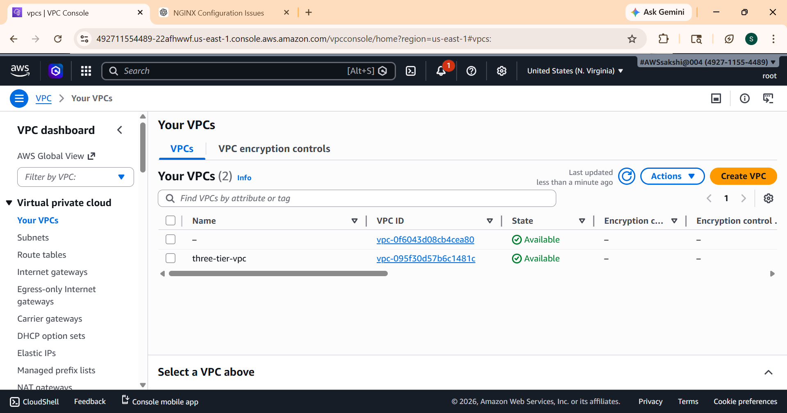
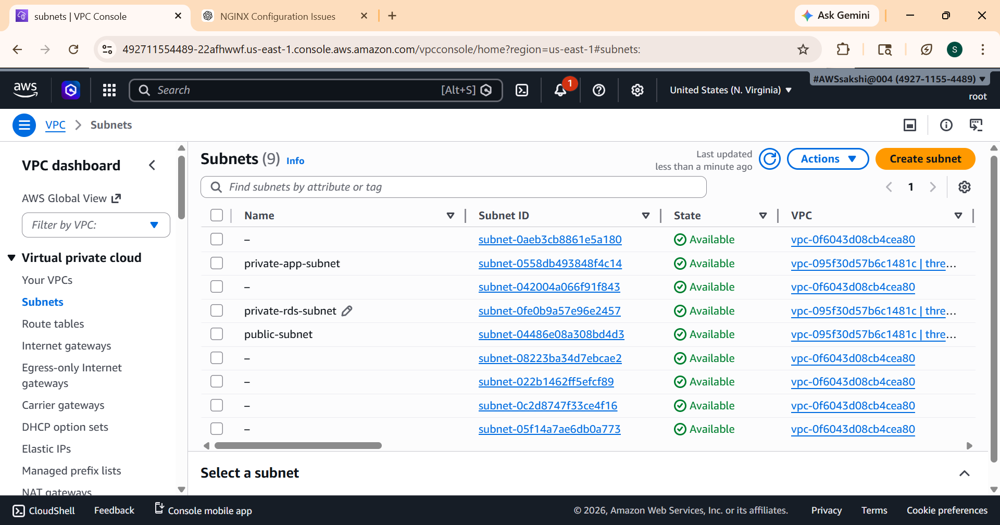
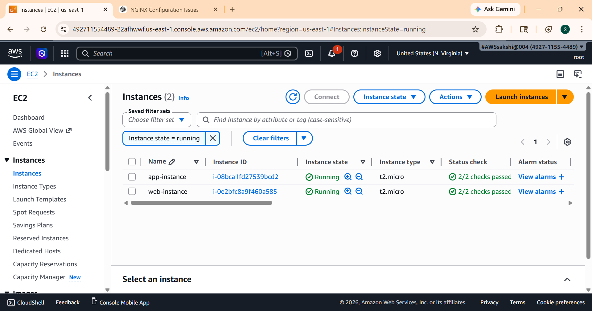
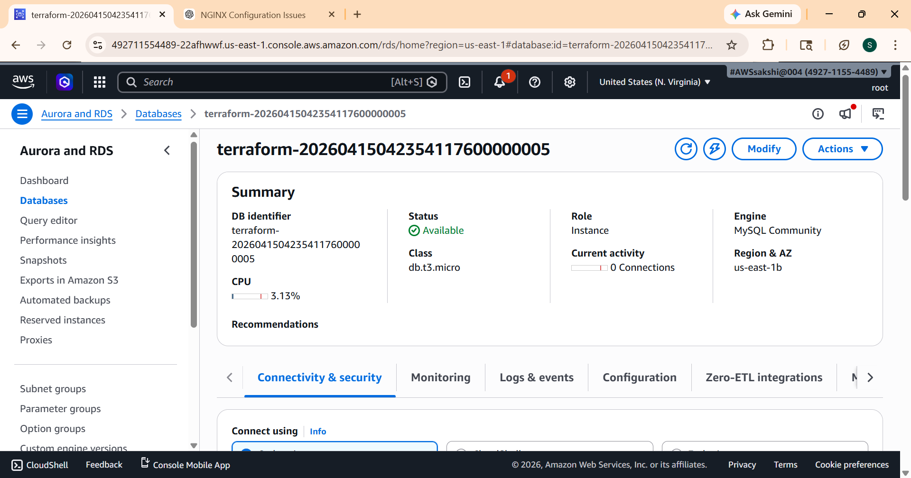
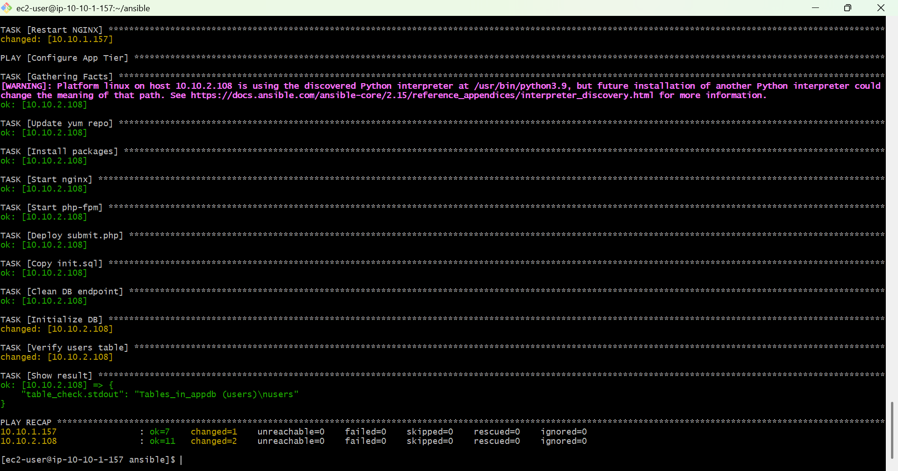
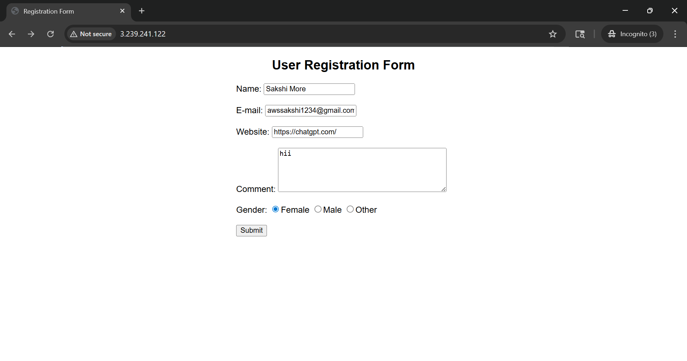
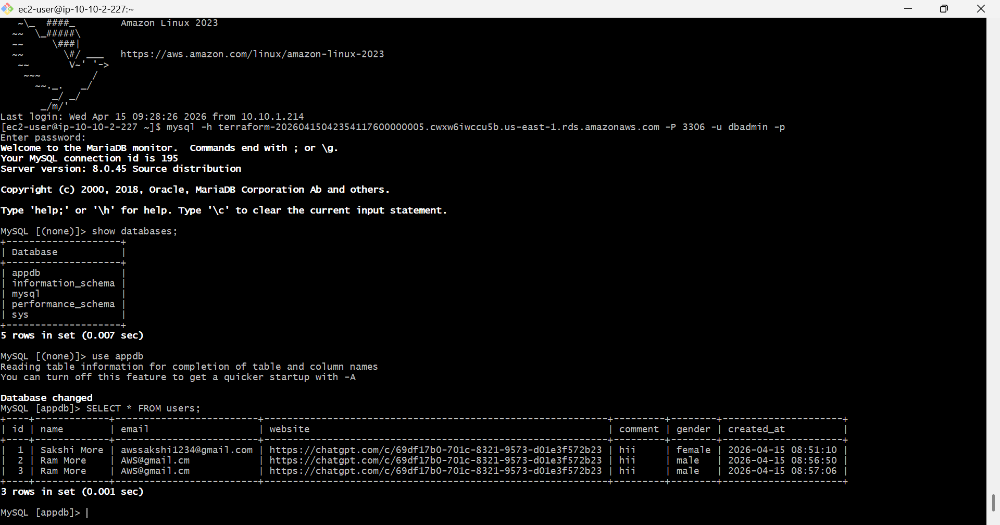

#  3-Tier Infrastructure Deployment Using Terraform & Ansible on AWS

##  Project Overview

This project demonstrates how to design and deploy a 3-Tier Web Application Architecture on AWS using:

- **Terraform** (Infrastructure as Code)
- **Ansible** (Configuration Management)

The architecture separates the system into **Web, Application, and Database tiers to improve security, scalability, and maintainability.**

The architecture consists of:
- **Web Tier (Public Subnet)** → Nginx + HTML registration form
- **Application Tier (Private Subnet)** → PHP backend (submit.php)
- **Database Tier (Private Subnet)** → Amazon RDS (MySQL/PostgreSQL)

---

 ## Architecture Diagram

---

## Technologies Used

- AWS (EC2, VPC, RDS, Subnets, Security Groups, NAT Gateway)
- Terraform (Infrastructure as Code)
- Ansible (Configuration Management)
- Nginx (Web Server)
- PHP (Backend scripting)
- MySQL/PostgreSQL (Database)

---

## 📁 Project Structure
```
terraform-3tier-project/
│
├── terraform/
│   ├── main.tf
│   ├── variables.tf
│   ├── outputs.tf
│   ├── provider.tf
│   │
│   └── modules/
│       ├── vpc/
│       ├── ec2-web/
│       ├── ec2-app/
│       └── rds/
│
├── ansible/
│   ├── hosts.ini
│   ├── vars.yml
│   ├── playbook.yml
│   │
│   ├── templates/
│   │   ├── form.html
│   │   └── submit.php
│   │
│   └── files/
│       └── init.sql
│
└── README.md
```
---
## Architecture Components
### 1️ Networking (VPC Setup)
-  Custom VPC
- Public Subnet for Web Tier
- Private Subnet for Application Tier
- Private Subnet for Database Tier
- Internet Gateway for public internet access
- NAT Gateway for private subnet outbound access
- Route Tables with correct subnet associations
- Security Groups for controlled access
###  2️ Web Tier (Public Subnet)
- 1 EC2 instance
- Installed using Ansible
- Runs Nginx Web Server
- Hosts HTML Registration Form

User Flow:

 **User → Web EC2 (Nginx) → App EC2 (PHP) → RDS Database**
### 3️ Application Tier (Private Subnet)
- 1 EC2 instance
- Runs PHP backend
- Handles form submission using:

`` submit.php``

**Responsibilities:**

- Receive form data
- Process request
- Store data in database

### 4 Database Tier (Private Subnet)
- Amazon RDS (MySQL/PostgreSQL)
- Protected inside private subnet
- Access allowed only from App Tier

Security:

``App EC2 → RDS
(No public access)``

---
# Deployment Steps
## Step 1 Deploy Infrastructure Using Terraform
### Terraform Execution 

- Initialize Terraform
```
terraform init
``` 
- Plan
```
terraform plan 
```
- Apply Infrastructure
```
terraform apply
```


---
## Infrastructure is now successfully deployed and all AWS resources are running.

### Terraform Creates the Following Resources
- **VPC**

- **SUBNET** 

- **Ec2 INSTANCES**

- **RDS**

---
## Ansible Configuration Management
## Step 2 Install Ansible on Web EC2
- Connect to the **Web EC2 instance:**
```
ssh -i <key.pem> ec2-user@<WEB_PUBLIC_IP> 
```
- Update the server:
```
sudo yum update -y
```
- Install Ansible:
```
sudo yum install ansible -y
```
## Step 3: Create Ansible Project Structure
```
ansible/
   ├── hosts.ini
   ├── vars.yml
   ├── playbook.yml
   │
   ├── templates/
   │   ├── form.html
   │   └── submit.php
   │
   └── files/
      └── init.sql
```
## Step 4 : Configure Ansible Inventory
- Move to the ansible directory:
```
cd ansible/
```
- Run the Ansible playbook:
```
ansible-playbook -i hosts.ini playbook.yml
```

---
This will configure:

- Nginx Web Server
- PHP Backend
- Application files deployment
- Database connection setup
----
## Step 5: Final End-to-End Test
- Open Browser & hit
```
http://<WEB_PUBLIC_IP>
```


## Step 6:Connect to RDS from App EC2

- SSH into the Web Server:
```
ssh -i key.pem ec2-user@<WEB_PUBLIC_IP>
```
- From Web Server connect to App Server:
```
ssh ec2-user@<APP_PRIVATE_IP>
```
- Connect to the RDS database:
```
mysql -h <RDS_ENDPOINT> -u admin -p
password:
```


## Summary
This project demonstrates the successful deployment of a secure and automated 3-tier web application architecture on AWS using Terraform and Ansible. Terraform was used to provision the complete infrastructure, including the VPC, subnets, EC2 instances, security groups, and Amazon RDS, while Ansible automated the configuration of the web and application servers. The architecture separates the Web, Application, and Database tiers across public and private subnets to ensure better security and scalability. NGINX serves the HTML registration form in the web tier and acts as a reverse proxy to forward requests to the application tier, where PHP processes user input and stores it in the RDS database. Throughout the implementation, real-time issues such as SSH permission errors and reverse proxy configuration problems were identified and resolved.providing hands-on experience with cloud infrastructure automation, configuration management, and troubleshooting in a real-world DevOps environment.
